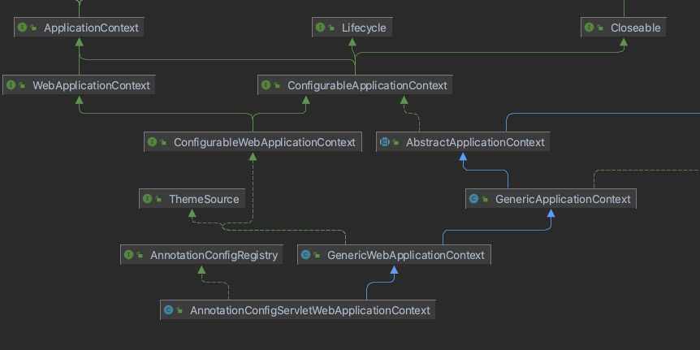

# 第三章 SpringMVC基础

    Spring MVC是基于Servlet API构建的，其Servlet的实现为DispatcherServlet；Spring MVC同时使用了一个Spring容器（WebAppcationContent）,使Servlet和Spring容器结合在一起。

    在Web应用程序中，Spring Boot会自动创建一个Spring Ioc容器以供Web应用程序使用，其类型为AnnotationConfigServletWebSeverAplicationContent，这个类型就实现前文提到的WebApplicationContent接口，其继承图如下所视。

